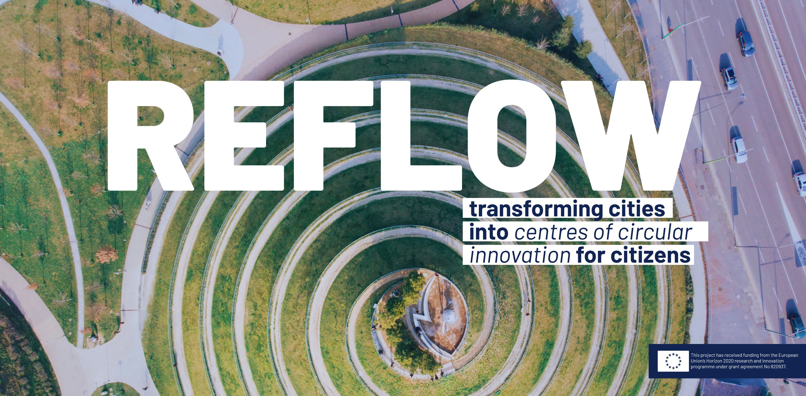

  

### Vision

We’re working to transform urban metabolisms from a linear to a circular strategy. This begins with using existing materials for local production and scaling up to create new supply chains between small and medium businesses and industries at the city and regional level.

*Read the Whitepaper*

### Mission

We’re exploring this approach in six pilot cities across Europe whilst developing open-source tools and resources to share with the wider community.

### Concept

REFLOW is a three-year action research project aiming to transform urban metabolisms, from the traditional “resource in, waste out” system to a circular one. Our strategy begins with using existing materials and repurposing them for local production. It then scales up to include the creation of new types of production and supply chains between small businesses and industries at both the city and regional levels.

At the core of our approach are Fab Labs and community production spaces, sites where local government and citizens, businesses and industry leaders, researchers and academics and municipal and EU organizations and institutions can work together to build these strategies and solutions. These strategies will form a toolkit which will be applied to 6 pilot cities, though the results from the cities will also contribute to the toolkit’s contents.

REFLOW will also use data visualisation tools and blockchain technologies to promote circular practices in local ecosystems. These technologies will aid in monitoring and optimising a circular urban metabolism and intervention management.

### Pilots

#### Textile (Life)cycling

#### Amsterdam

#### Consortium members involved

How can the lifecycle of textiles be rethought in collaboration with citizens and stakeholders?

#### Revamping Public Property

#### Berlin

#### Consortium members involved

Integrating civic input and smart solutions into the management and design of public buildings.

#### Food Market 2.0

#### Milan

#### Consortium members involved

Supporting the transition to a more circular food system by connecting and adapting traditional food marketplaces to the consumption patterns and lifestyles of modern citizens

#### FairTracker

#### Paris

#### Consortium members involved

Building a circular economy approach to event waste management by creating a tracking system to coordinate the use and reuse of materials involved in the trade fair sector

#### Circular Plastics

#### Vejle

#### Consortium members involved

Designing sustainable solutions to make the use of plastic more circular while also reducing the need for plastic

#### PlEnergy

#### Cluj-Napoca

#### Consortium members involved

Developing a platform that will support urban energy monitoring and the co-creation of the city’s energy transition

### Handbooks & Toolkits

A “how-to” on creating and monitoring regenerative and circular cities using information learned from local pilots.

### Documentation

Fieldwork from the pilots to understand the cities’ metabolisms and potential circular economy models for business and government and to establish partnerships between local stakeholders and the pilots.

### Business strategies

Co-created circular economy-based business models developed within the pilot cities and assessed for their social, economic, and environmental impact. Business model strategies will be designed to align with global practice of the Fab City Global Initiative, which is working on PITO to DIDO.

### Platforms

An Open Data Dashboard made up of: a decision-making tool to enable a flexible and innovative urban planning approach, tools to guide the transition to circular cities and data to enable continuous monitoring and optimization of urban metabolic processes

### Webinars

Webinars are a tool for knowledge transfer, exploring successes, problems and how-to’s to inspire and guide stakeholders and cities around the world.

